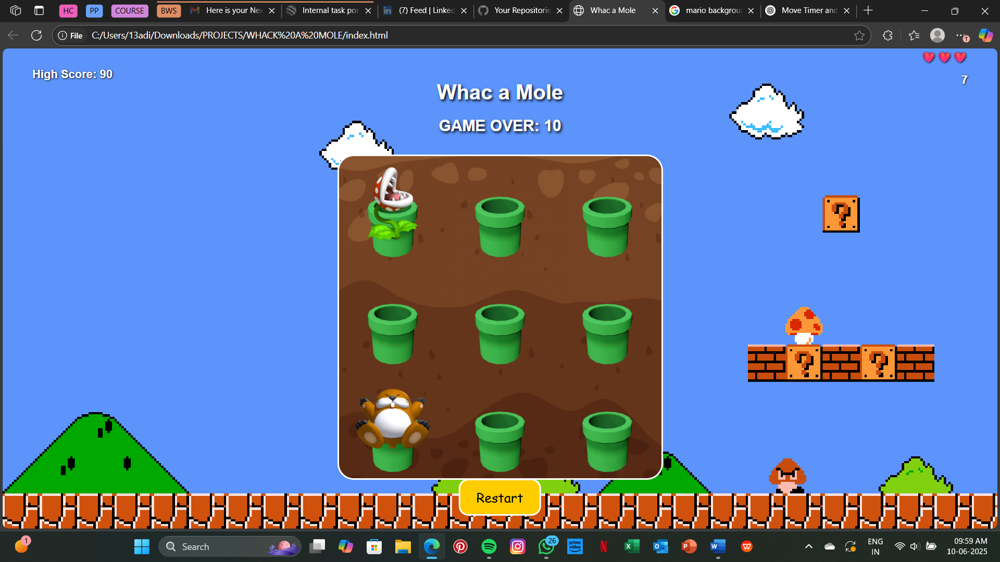
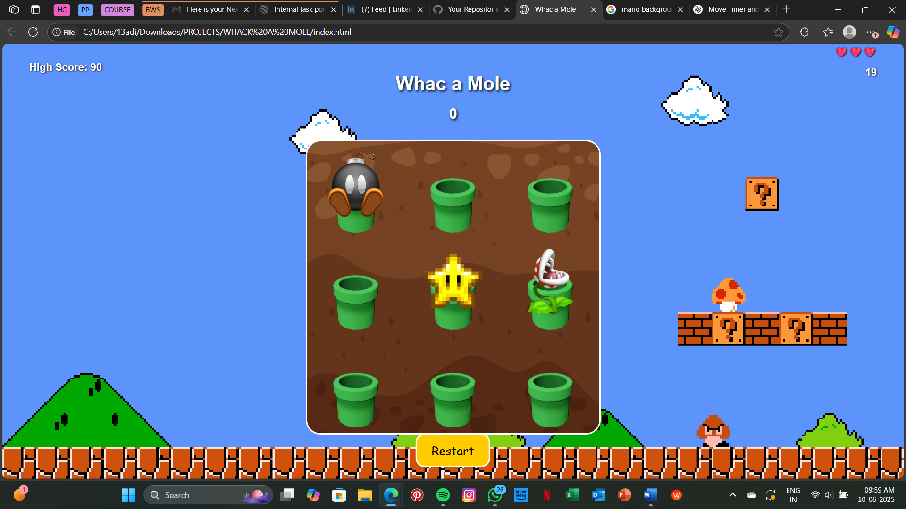
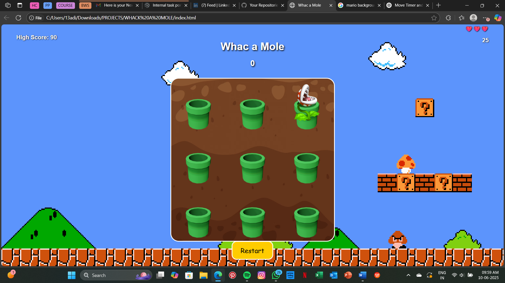

# 🔨 Whac a Mole

A fun and chaotic **Whac-a-Mole** game built using **HTML**, **CSS**, and **JavaScript** — now with Mario-themed visuals, power-ups, bombs, character selection, and sound! 🎮🌟

---

## 🎯 Features

- 🎩 **Character selection** – Play as Mario, Luigi, or Peach.
- 🐹 **Classic gameplay** – Whack the moles to score!
- 💣 **Obstacles** – Avoid piranha plants and bombs.
- ⭐ **Power-ups** – Get special effects like double points or extra lives.
- ❤️ **Lives system** – Make three mistakes and it’s game over!
- ⏱️ **Timer-based gameplay** – Play against the clock.
- 🔁 **Restart button** – Start a new game instantly.
- 🎵 **Dynamic background music** – Based on your selected character.
- 🖱️ **Custom cursor hammers** – Unique to each character.
- 📱 **Responsive layout** – Optimized for all screen sizes.

---

## 🎮 How to Play

- Click on **Monty Mole** to score points.
- Avoid clicking on:
  - 🌱 **Piranha Plant** – Ends the game instantly.
  - 💣 **Bomb** – Deducts points.
- Click the ⭐ **Star Power-up** for one of:
  - ✨ Double points for a few seconds
  - ⛔ Pause plant attacks
  - ❤️ Gain an extra life
- Select a character at the start for custom visuals and sounds.
- Game ends when time runs out or you run out of lives.
- Press **Restart** to try again!

---

## 🧰 Technologies Used

- **HTML5** – Structure & layout
- **CSS3** – Styling, custom cursors, animation
- **JavaScript** – Game logic, timers, DOM interaction, sound

---

## 💻 How to Run Locally

1. Clone the repository:

   ```bash
   git clone https://github.com/yourusername/whac-a-mole-game.git

2. Open `index.html` in your favorite web browser.

3. Start playing!

## Screenshots

Here are some screenshots of the game:







## Future Improvements

- 💾 Save and display high scores using localStorage

- 🧠 Smarter and faster mole/plant AI for higher difficulty

- 🔊 Add sound effects for each action (hit, miss, power-up)

- 📱 Touch support and vibration feedback on mobile

- 🏆 Difficulty levels: Easy, Normal, Hard

- 🌍 Add leaderboard or multiplayer mode

